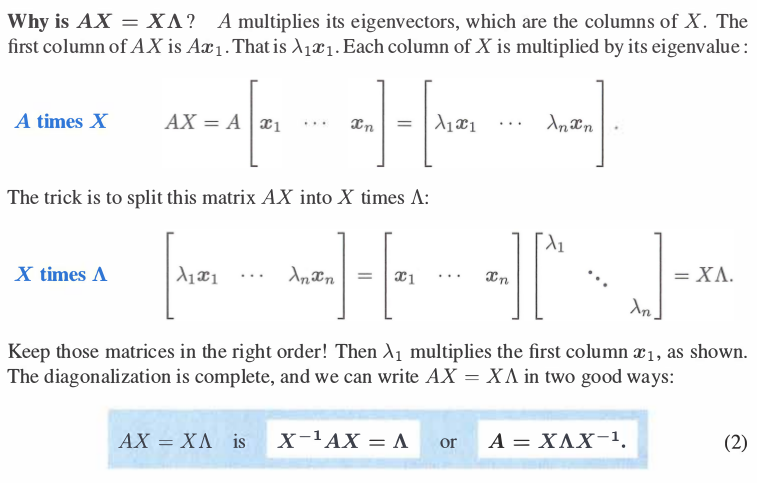
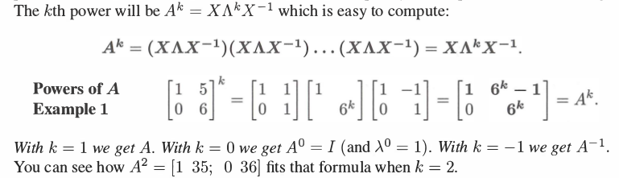
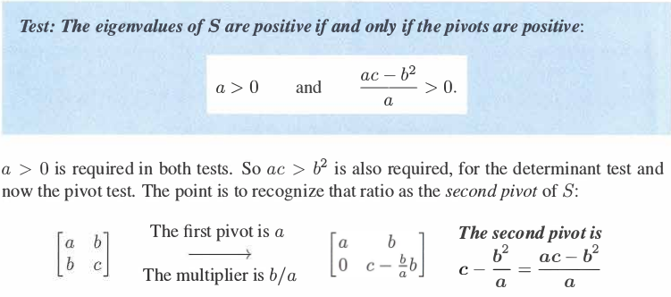
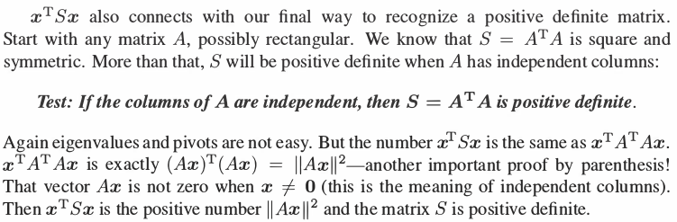
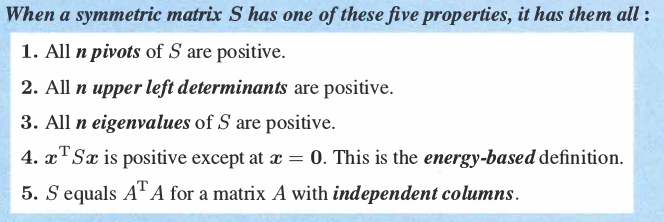

[TOC]

# 特征值和特征向量

前提: 都是针对方阵来进行讨论.  

## 1. 定义和例子
TODO

## 2. 利用特征值和特征向量对矩阵进行对角化

假设矩阵$A$大小为nxn, 有n个不同的特征值, 于是有对应的n个线性无关的特征向量, 则可以进行如下分解:  

从图可见, $\Lambda$为特征值组成的矩阵, $X$为对应特征向量组成的矩阵.  

**应用: 求$A^n$**

## 3. 微分方程的求解和矩阵的指数
TODO

## 4. 对称矩阵

> It is no exaggeration to say that symmetric matrices are the most important matrices the world will ever see - in the theory of linear algebra and also in the applications.

当矩阵$A$为对称矩阵, 即$A = A^T$, 特征方程$Ax = \lambda x$又会有什么特殊的性质呢?  

**(1) 推导**:  

$A = X \Lambda X^{-1}$, 因为$A = A^T$, 所以$A^T = (X^{-1})^{T} \Lambda X^T$.  
由此得到: $X^TX = I$, 即$X$中的各个特征向量之间是正交的. 如果我们把每个特征向量归一化, 得到正交矩阵$Q$.  

**(2) 结论**:  

- 对称矩阵只存在实特征值(实数特征值).  
- 对称矩阵的特征向量组可以是正规化的(orthonormal, 正交归一化的).  

**(3) 定理**:  
每一个对称矩阵$A$都可以进行如下分解:  
$A = Q \Lambda Q^T$, $Q$是正交矩阵, 其中每一列都是$A$的正规化的特征向量.  
$$
A = Q \Lambda Q^{-1} = Q \Lambda Q^T
$$
with $Q^T = Q^{-1}$

## 5. 正定矩阵(Positive Definite Matrices)

> Symmetric matrices with positive eigenvalues are at the center of all kinds of applications. They are called **positive definite**.

**定义**:  
特征值都是正数(all $\lambda$ > 0)的对称矩阵. 同时所有的主元(pivot)也都是正数, 所有的子行列式也都是正数.   

**本节目标**:  

- 如何快速判断一个对称矩阵是否正定(不需要计算所有的特征值)  
- 正定性质的重要性
- 利用正定性质判断是否存在极小值  

### 5.1 判断矩阵是否为正定矩阵:  

**基于主元的判断法**
主元的符号和特征值的符号一样. 正主元的个数和正特征值的个数一样多.  

**基于能量的判断法**:  
在很多问题里面, $\frac{1}{2}x^TAx$ 是整个系统的能量.  

### 5.2 半正定矩阵

半正定矩阵的行列式为0.  最小的特征值为0. (all $\lambda \geq 0$ 并且 $x^TAx \geq 0$ ).  

### 5.3 正定和极小值的关系

如果某个函数$f(x)$, 自变量为向量$x$, 它的一阶导数为0, 二阶导数矩阵是正定矩阵的话, 那么存在局部最小值(极小值).  

## 6. 总结

(1) 使用特征方程来求解矩阵的特征值和特征向量, 直观意义是矩阵作用在特征向量上, 得到的向量方向保持不变, 长度缩放特征值倍数.  
(2) 利用特征值和特征向量对矩阵进行分解. 可以应用于求解矩阵的n次方等.  
(3) 如果矩阵是对称矩阵, 若它的特征向量之间线性无关, 那么特征向量矩阵中的列向量归一化后变成正交矩阵.  
(4) 如果对称矩阵的所有特征值大于0, 它是正定矩阵.  

## 参考
[[1] Strang G, Strang G, Strang G, et al. Introduction to linear algebra[M]. Wellesley, MA: Wellesley-Cambridge Press, 1993.](http://math.mit.edu/~gs/linearalgebra/)

