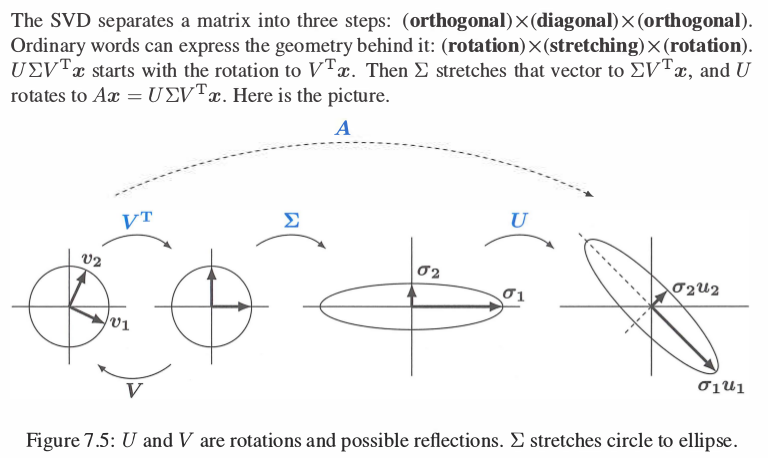

# 奇异值分解(SVD)

前面提到对于方阵$A$, 大小为nxn, 在一定条件下, 可以进行特征值和特征向量分解. 但存在问题:  
- 方阵$A$的特征向量并不正交(只有是对称矩阵的情况下才正交).  
- 方阵$A$的特征向量数量不够(即不满足n个特征向量组是线性相关的).  
- 并不是一个方阵(A可能并不是方阵).  

这种情况下如何对大小为mxn的矩阵$A$ 进行分解呢? $A$的奇异向量能够完美地解决上述问题.  

## 1. SVD的推导

**目标**: 寻找**行空间的一组标准正交基**, 作用$A$以后, **变换到列空间的一组正交基**(倍数乘以标准正交基).  
$$
Av_1 = \sigma_1 u_1, Av_2 = \sigma_2 u_2, ... , Av_r = \sigma_r u_r
$$
$v_i \in \mathbb{R}^n, u_i \in \mathbb{R}^m$
所以可以得到:  
$$
A \begin{bmatrix} v_1&...&v_r\end{bmatrix} =
\begin{bmatrix} u_1&...&u_r\end{bmatrix}
\begin{bmatrix}\sigma_1\\&.\\&&.\\ &&& \sigma_r \end{bmatrix}
\Rightarrow AV = U\Sigma
$$
其中$V \in C(A^T)$, $A$的行空间, $U\in C(A)$, $A$的列空间. 如果矩阵 $A$ 的行列空间不满秩, 那么会对$U$和$V$补上相应数量的对应零空间中的单位正交向量成为方阵, 写成如下形式:  
$$
A \begin{bmatrix} v_1&...&v_r&..&v_n\end{bmatrix} =
\begin{bmatrix} u_1&...&u_r&..&u_m\end{bmatrix}
\begin{bmatrix}\sigma_1\\&.\\&&.\\ &&& \sigma_r \\ &&&& \end{bmatrix}
\Rightarrow AV = U\Sigma
$$
综上可以得到SVD的表达式:  
$$
A = U \Sigma V^{-1} = u_1 \sigma_1 v_1^T + ... + u_r \sigma_r v_r^T
$$
又因为, $V$是一个正交阵, 所以$V^T = V^{-1}$, 代入上式, 得:  
$$
A = U \Sigma V^{-1} = U \Sigma V^T
$$

## 2. 如何求解$U$, $\Sigma$ 和 $V$

**计算$A^TA$可以消去$U$**:  
$$
A^TA = V \Sigma^T U^T U \Sigma V^T =
V \begin{bmatrix} \sigma_1^{2} \\&.\\&&.\\ &&& \sigma_r^{2} \\ &&&& \\ \end{bmatrix} V^T
$$
可以发现, $A^TA$的结果恰好和$A^TA$的特征值分解的形式相同. 也就是说矩阵$V$由$A^TA$的特征向量组成, 特征值为$\sigma_i^{2}$. 即我们求解特征方程 $A^TA v = \sigma_i^{2} v$.  

**计算$AA^T$可以消去$V$**
$$
AA^T = U \Sigma V^T V \Sigma^T U^T =
U \begin{bmatrix} \sigma_1^{2} \\&.\\&&.\\ &&& \sigma_r^{2} \\ &&&& \\ \end{bmatrix} U^T
$$
同理, $AA^T$的结果恰好和$A^TA$的特征值分解的形式相同. 也就是说矩阵$U$由$AA^T$的特征向量组成, 特征值为$\sigma_i^{2}$. 即我们求解特征方程 $AA^T u= \sigma_i^{2} u$.  

## 3. SVD的几何形式

从图中可以看出对矩阵A的SVD分解可以表示成一个圆到一个椭圆的变换过程.  

## 4. 矩阵A的伪逆(Pseudoinverse)和SVD求解最小二乘

(1) 伪逆的定义  
前面讲到任意大小的普通矩阵都可以奇异值分解. 从 $Av = \sigma u$ 出发进行推导.  如果$A$是一个可逆的方阵, 那么有 $A^{-1}u = \frac{1}{\sigma} v$. 那么相应的SVD分解形式也会变成:  
$$
A = U \Sigma V^T \Rightarrow A^{+} = V \Sigma^{+} U^{T}
$$
其中的 $+$ 表示伪逆, 如果 $A$ 是方阵并且的确存在逆的话, 结果就是 $A$ 的逆. 但是如果矩阵 $A$ 的行空间不满秩或者列空间不满秩, 那么不管是不是方阵, 就会导致 $A$ 不存在逆. 这时候就定义矩阵 $A$ 的伪逆.  

(2) SVD形式的伪逆应用求解最小二乘  
在正交投影的章节中, 我们从几何的形式推导出, 求解最小二乘问题, 可以通过求解正规方程(normal equation).  
$$
A^TA \widehat{x} = A^Tb \Rightarrow \widehat{x} = A(A^TA)^{-1}A^Tb
$$
这其中, 我们假设矩阵 $A$ 和 $A^TA$ 是可逆的. 现在如果 $A$ 不满秩, 那么就会导致正规方程存在多个解, 而不是唯一解. 原来 $Ax=b$ 中的A是满秩的, $b$ 不在 $A$ 的列空间中, 方程没有解, 因此需要求解最小二乘解.  如果 $A$ 不满秩, 则其中一个解为 $x^{+} = A^{+}b $ , 并且可以证明这个解 $x^{+}$ 是所有解最小的那个.   
证明: **TODO**

## 总结

- 矩阵的特征值和特征向量分解适用于特定的矩阵, 对于任意大小的普通矩阵, 可以使用SVD分解.  
- 矩阵 $A$ 将 $C(A^T)$ 中的一组标准正交基变换到 $C(A)$ 中的一组正交基. 由此可以推导出 $A = U \Sigma V^T$ 的分解形式.  
- 通过 $A^TA$ 的对称矩阵形式可以消去 $U$ , 从而得到 $V$ 和 $\Sigma$ 的求解方式. 同理通过 $AA^T$ 的对称矩阵形式可以得到 $U$ 和 $\Sigma$ 的求解方式.  

## 参考

[[1] Strang G, Strang G, Strang G, et al. Introduction to linear algebra[M]. Wellesley, MA: Wellesley-Cambridge Press, 1993.](http://math.mit.edu/~gs/linearalgebra/)